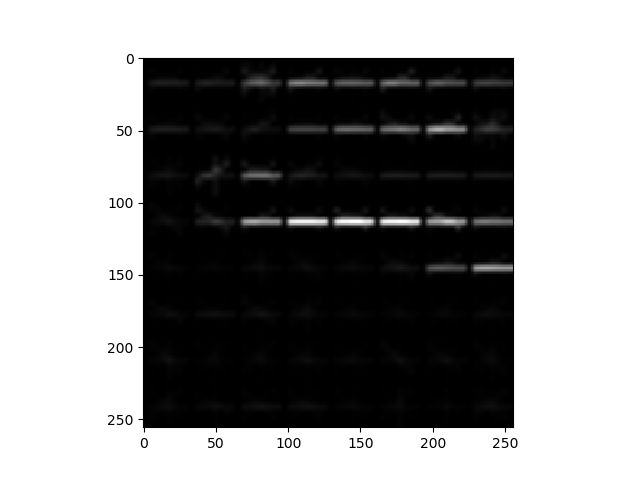

## Vehicle Detection Project

---


**Vehicle Detection Project**

The goals / steps of this project are the following:

* Perform a Histogram of Oriented Gradients (HOG) feature extraction on a labeled training set of images and train a classifier Linear SVM classifier
* Optionally, you can also apply a color transform and append binned color features, as well as histograms of color, to your HOG feature vector. 
* Note: for those first two steps don't forget to normalize your features and randomize a selection for training and testing.
* Implement a sliding-window technique and use your trained classifier to search for vehicles in images.
* Run your pipeline on a video stream (start with the test_video.mp4 and later implement on full project_video.mp4) and create a heat map of recurring detections frame by frame to reject outliers and follow detected vehicles.
* Estimate a bounding box for vehicles detected.


## SVM vs CNN

This project was an interesting benchmark on SVM versus CNN. Although it is very important to understand image features and work with traditional computer vision features, this project was done, at the end, with a deep learning network.

The reason to choose a convolutional neural network, instead of a HOG + SVM is that a good SVM for classifying car and non-car images should use a nonlinear SVM, which is very slow. A linear SVM is faster, but we need more features and more sliding windows, making it slower than a CNN+slidding window solution.


## [Rubric  Points](https://review.udacity.com/#!/rubrics/513/view)

### Here I will consider the rubric points individually and describe how I addressed each point in my implementation.  

---

### Histogram of Oriented Gradients (HOG)

#### 1. HOG

The code for this step is contained in the function `train_SVM()` in lines 156 through 170 of the file called `track_vehicle.py`).  

I started by reading in all the `vehicle` and `non-vehicle` images.  Here is an example of one of each of the `vehicle` and `non-vehicle` classes:

<center>
 

</center>

I then explored different color spaces, namely RGB, YCrCb, HSV and LUV, and different `skimage.hog()` parameter (`orientations`). I grabbed random images from each of the two classes and displayed them to get a feel for what the `skimage.hog()` output looks like.

Here is an example using the `RGB` color space and HOG parameters of `orientations=8`, `pixels_per_cell=(8, 8)` and `cells_per_block=(2, 2)`:


<center>
<p> Car Image HOG</p>
 


</center>
<center>
<p> Non Car Image HOG</p>
 



</center>

#### 2. Explain how you settled on your final choice of HOG parameters.

As the final solution for this project was a convolutional neural network, there was not a final decision on HOG. But a reasonable performance with a non linear SVM was obtained the R channel of an RGB image and HOG parameters of `orientations=8`, `pixels_per_cell=(8, 8)` and `cells_per_block=(2, 2)`.

#### 3. Describe how (and identify where in your code) you trained a classifier using your selected HOG features (and color features if you used them).

As stated above an SVM was not used on final solution. But test was made using HOG parameters of `orientations=8`, `pixels_per_cell=(8, 8)` and `cells_per_block=(2, 2)` with different color spaces, namely RGB, YCrCb, HSV and LUV and including color histograms and spatial features.

### Sliding Window Search


I decided to search window positions at 3 different scales over the image as shown below:

| Windows Size | Y- Axis Search Area | Overlap |                                                         |
| ------------ | :-----------------: | :-----: | ------------------------------------------------------: |
| 32 x 32      | (400, 464)          | 75%     |   |
| 64 x 64      | (400, 665)          | 50%     |   |
| 165 x 165    | (500, 665)          | 50%     |  |

```python
windows.extend(slide_window(image, x_start_stop=[None, None], y_start_stop=(400, 665), xy_window=(64, 64), xy_overlap=(0.75, 0.75)))

windows.extend(slide_window(image, x_start_stop=[None, None], y_start_stop=(400, 464), xy_window=(32, 32), xy_overlap=(0.5, 0.5)))

windows.extend(slide_window(image, x_start_stop=[None, None], y_start_stop=(500, 665),xy_window=(165, 165), xy_overlap=(0.5, 0)))
```

The code was the same as taught in course. The images below show all the grids without overlaping.


<center>
 
</center>


#### 2. Samples Images with Sliding Window Search

Below we show two frames processed by the CNN + sliding window.


<center>
 
 
</center>


---
### Convolutional Neural Network

### Model Architecture and Training Strategy


#### 1. An appropriate model architecture has been employed

My model was based on the project `Behavioral Cloning` and consists of a convolution neural network with 5x5 and 3x3 kernel sizes and depths between 24 and 64. The complete network summary is shown below.

```sh
_________________________________________________________________
Layer (type)                 Output Shape              Param #
=================================================================
lambda_1 (Lambda)            (None, 64, 64, 3)         0
_________________________________________________________________
conv2d_1 (Conv2D)            (None, 32, 32, 24)        1824
_________________________________________________________________
leaky_re_lu_1 (LeakyReLU)    (None, 32, 32, 24)        0
_________________________________________________________________
conv2d_2 (Conv2D)            (None, 16, 16, 36)        21636
_________________________________________________________________
leaky_re_lu_2 (LeakyReLU)    (None, 16, 16, 36)        0
_________________________________________________________________
conv2d_3 (Conv2D)            (None, 8, 8, 48)          43248
_________________________________________________________________
leaky_re_lu_3 (LeakyReLU)    (None, 8, 8, 48)          0
_________________________________________________________________
dropout_1 (Dropout)          (None, 8, 8, 48)          0
_________________________________________________________________
conv2d_4 (Conv2D)            (None, 6, 6, 64)          27712
_________________________________________________________________
leaky_re_lu_4 (LeakyReLU)    (None, 6, 6, 64)          0
_________________________________________________________________
conv2d_5 (Conv2D)            (None, 4, 4, 64)          36928
_________________________________________________________________
leaky_re_lu_5 (LeakyReLU)    (None, 4, 4, 64)          0
_________________________________________________________________
flatten_1 (Flatten)          (None, 1024)              0
_________________________________________________________________
dropout_2 (Dropout)          (None, 1024)              0
_________________________________________________________________
dense_1 (Dense)              (None, 100)               102500
_________________________________________________________________
dense_2 (Dense)              (None, 50)                5050
_________________________________________________________________
dense_3 (Dense)              (None, 10)                510
_________________________________________________________________
dense_4 (Dense)              (None, 1)                 11
_________________________________________________________________
activation_1 (Activation)    (None, 1)                 0
=================================================================
Total params: 239,419
Trainable params: 239,419
Non-trainable params: 0
_________________________________________________________________

```
As the CNN was used as a classifiers with binary output (car / not-car), the last layer used a sigmoid activation function and the loss function used was a `binary_crossentropy`

#### 2. Attempts to reduce overfitting in the model

The model contains dropout layers in order to reduce overfitting (`track_cnn.py` lines 141 and 147). 

The model was trained and validated on different data sets to ensure that the model was not overfitting (code line  175-176).

#### 3. Model parameter tuning

The model used an adam optimizer with an start learning rate of 1.0e-4, so the learning rate was not tuned manually (`track_cnn.py` line 199).

---
### Video Implementation

#### 1.  Final Video
Here's a [link to my video result](https://youtu.be/ALX-2v3E4VM)


#### 2. HeatMap

I recorded the positions of positive detections in each frame of the video.  From the positive detections I created a heatmap and then thresholded that map to identify vehicle positions.  I then used `scipy.ndimage.measurements.label()` to identify individual blobs in the heatmap.  I then assumed each blob corresponded to a vehicle.  I constructed bounding boxes to cover the area of each blob detected.  

Here's an example result showing the heatmap from a series of frames of video, the result of `scipy.ndimage.measurements.label()` and the bounding boxes then overlaid on the last frame of video:

### Here are six frames and their corresponding heatmaps:
<center>
<p> Frame</p>
 


</center>
<center>
<p> HeatMap</p>
 
 
 
 
 
 
</center>

<center>
<p> Fianl Images</p>
 
 
 
 
 
 
</center>

---

### Discussion

At the end I used a naive approach of CNN + sliding window. However, There are already DL techniques, such as, YOLO ou Fast RCNN, that output the bounding boxes, and they are much faster than the technique I used. Using such implementations will improve the detction system and the speed of the search.
